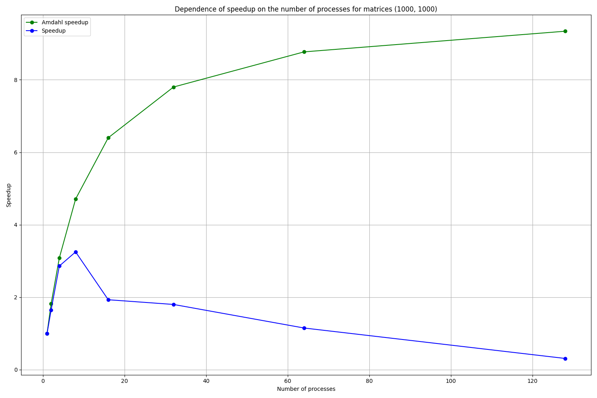
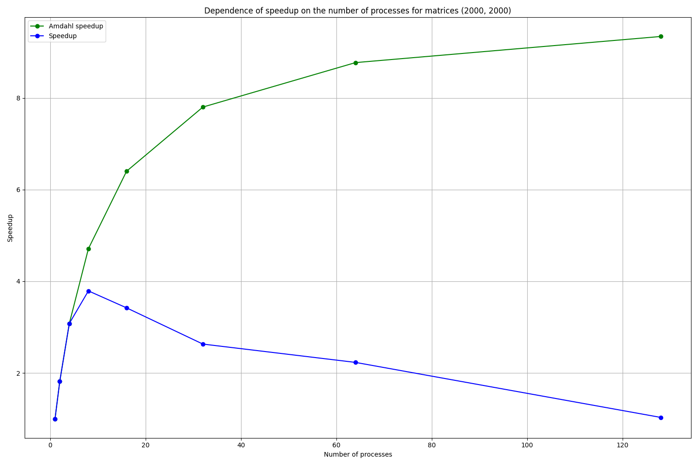

# Лабораторная работа №2

## Задание №A-06

Написать программу вычисления матричного выражения:

$A = Tr(B^3 C) E + I + B \\&\\& M$, где
- $Tr(...)$ - след матрицы, сумма ее диагональных элементов;
- $\\&\\&$ - поэлементное логическое «И».
- $B$, $C$ – квадратные плотные матрицы, элементы которых имеют тип `double`, их элементы задаются с помощью генератора псевдослучайных чисел;
- $E$ – полностью заполненная матрица, все элементы которой равны $1$;
- $I$ – единичная матрица, все диагональные элементы которой равны $1$;
- $M$ – матрица, элементы которой принимают значения $0$ или $1$ и задаются произвольным образом;

Необходимо распараллелить эту программу с помощью MPI. Исследовать зависимость масштабируемости параллельной версии программы от ее вычислительной трудоемкости (размера матриц). Проверить корректность параллельной версии. Проверить закона Амдала. Построить зависимость ускорения от числа процессов для заданного примера.

## Программно-аппаратная конфигурация

```
System:
  Distro: Ubuntu 22.04.4 LTS (Jammy Jellyfish)
  Kernel: 5.15.0-122-generic x86_64
  Bits: 64
  Compiler: GCC 11.4.0
  Interpreter: Python 3.10.12
```

```
CPU:
  Model: Intel Xeon E-2136
  Architecture: Coffee Lake
  Cores: 6-core
  Bits: 64
  Speed (MHz):
    Min: 800
    Max: 4500
  Cache:
    L1: 384 KiB
    L2: 1.5 MiB
    L3: 12 MiB
  Flags: 
    avx avx2 ht lm nx pae
    sse sse2 sse3 sse4_1
    sse4_2 ssse3 vmx
```

```
RAM:
  Total: 62.67 GiB
```

## Команды

Компиляция и запуск вычисления матричного выражения с указанным числом процессов и размерностью матриц. Результатом являются данные о времени матричного вычисления для указанных аргументов в формате CSV.

```
mpic++ -std=c++17 -o matrix_computation matrix_computation.cpp 
mpiexec -n [processes] ./matrix_computation [dimension]
```

Запуск эксперимента, выполняющего компиляцию, вычисление матричного выражения, ускорения и эффективности, а также построение графиков времени, ускорения и эффективности по результатам вычисления в формате CSV.

```
python3 -m venv venv
./venv/bin/activate
pip install -r ./requirements.txt
python3 ./experiment.py
```

## Решение

### matrix_computation.cpp

В начале программы вызывается инициализация MPI `MPI_Init(&argc, &argv)`. Все пути завершения программы вызывают деинициализацию MPI `MPI_Finalize()`.

Перед началом матричных вычислений выполняется инициализация констант:
- `rank` - идентификатор текущего процесса ($0$ для основного, $1$ и более для порожденного);
- `size` - общее число процессов;
- `n` - размерность квадратной матрицы;
- `average = 5` - количество итераций для усреднения результатов.

Выполняется установка `seed` `srand(2001)` для воспроизводимой псевдослучайной генерации и инициализация числами `double` матриц из условия задачи в виде одномерных векторов, которую выполняет основной процесс:
- Матрицы $B$ и $C$ заполняются псевдослучайными числами, не умоляя общности, в отрезке $[0.0, 1.0]$;
- Матрица $E$ заполняется числами $1.0$;
- Матрица $I$ заполняется числами $1.0$ на диагонали;
- Матрица $M$ заполняется псевдослучайными числами $0.0$ и $1.0$.

Одномерность векторов необходима для корректной работы с буфером сообщений.

Инициализированные в основном процессе матрицы распространяются в порожденные процессы при помощи функции `MPI_Bcast()`. В итоге все процессы имеют одинаковые матрицы. Матрицы также переиспользуются между вычислениями.

В начале матричного вычисления определяются константы, необходимые для распараллеливания:
- `rows_per_process` - число строк матрицы, обрабатываемых каждым процессом;
- `start_row` - номер первой строки для выделения подматрицы для процесса, в зависимости от его `rank`; 
- `end_row` - номер последней строки для выделения подматрицы для процесса, в зависимости от его `rank`.

Затем создаются матрицы для хранения промежуточных результатов вычислений в каждом процессе.

Умножение матриц происходит методом «строка на столбец», но через умножение их подматриц, распределенных на каждый процесс по границам [`start_row`, `end_row`). Результат записывается промежуточную матрицу, что позволяет избежать зависимостей по данным.

После возведения $B^2$ каждый процесс содержит результат умножения подматриц. Поэтому для последующего возведения $B^3$ необходимо вычислить общий результат умножения матриц и синхронизировать его для всех процессов. Для этого используется функция `MPI_Allgather()`. `MPI_IN_PLACE` позволяет использовать один буфер для отправки и приема сообщений.

Вычисление $B^3 C$ не требует синхронизации через `MPI_Allgather()`, поскольку каждый процесс продолжает умножать свою подматрицу и не возникает зависимости по данным между процессами.

След матрицы $Tr(B^3 C)$ сначала вычисляется частично в каждом процессе, а затем с помощью `MPI_Allreduce()` вычисляется полностью и синхронизируется для всех процессов.

Следующим шагом происходит вычисление $Tr(B^3 C) E$ - умножение матрицы на константу, которое каждый процесс выполняет для своей подматрицы.

Затем каждым процессом вычисляется своя часть поэлементного логического «И» $B \\&\\& M$.

В заключении каждый процесс вычисляет свою часть результирующей матрицы $A$ через сумму раннее вычисленных подматриц $A = Tr(B^3 C) E + I + B \\&\\& M$. Общий результат вычисляется и синхронизируется между процессами с помощью `MPI_Allgather`.

Время вычисления замеряется в каждом процессе с помощью разности значений `chrono::high_resolution_clock::now()`, сохраненных до и после вычисления. Затем в основном процессе собирается общее время вычисления со всех процессов при помощи `MPI_Reduce()` и усредняется по их количеству. Сохраняется общее время всех итераций для последующего усреднения.

Перед завершением программы вычисляется среднее время, и результаты времени матричных вычислений сохраняются в формате CSV для дальнейшего представления и интерпретации.

### experiment.py

Для подсчета статистики, представления результатов в виде графиков и их интерпретации используется скрипт, который запускает матричные вычисления и получает результаты времени матричных вычислений в формате CSV. Для построения графиков используются `pandas` и `matplotlib`.

Сперва происходит запуск быстрого эксперимента с размерностью матриц $500$, чтобы проверить, что все работает. Затем эксперимент выполняется для матриц размерностью $1000$ и $2000$, что занимает ощутимо больше времени.

Для матриц указанной размерности происходит запуск вычислений с увеличением числа процессов по степеням числа $2$, максимальная степень указана $8$ (не включительно). По завершении эксперимента результаты времени матричных вычислений доступны в формате CSV. 

На их основе происходит подсчет статистики матричных вычислений. Вычисляются коэффициенты ускорения и эффективности исходя из полученных значений и законов Амдала, которые определяют предельные значения.
Размер параллельной части программы для законов Амдала был оценен как $0.9$. Статистика также сохраняется в формате CSV.

В ходе каждого эксперимента строится график времени, ускорения и эффективности матричных вычислений в сравнении с предельными значениями из законов Амдала.
На заключительном шаге строится график масштабируемости для матриц разной размерности.

## Результаты

### Размерность матриц $1000$

Таблица $1$ времени матричных вычислений для разного числа процессов. В таблице содержится время каждого из пяти запусков и среднее время для каждого числа процессов.

| Процессы | 1     | 2     | 3     | 4     | 5     | Среднее (сек.) |
|----------|-------|-------|-------|-------|-------|----------------|
| 1        | 22.73 | 22.72 | 22.71 | 22.77 | 22.73 | 22.73          |
| 2        | 13.58 | 13.82 | 13.88 | 13.89 | 13.88 | 13.81          |
| 4        | 7.90  | 7.95  | 7.96  | 7.95  | 7.97  | 7.95           |
| 8        | 6.98  | 7.00  | 6.99  | 6.99  | 7.00  | 6.99           |
| 16       | 11.87 | 11.81 | 11.95 | 11.96 | 11.41 | 11.80          |
| 32       | 12.68 | 12.41 | 12.60 | 12.45 | 12.94 | 12.62          |
| 64       | 19.98 | 19.60 | 19.36 | 19.58 | 20.41 | 19.79          |
| 128      | 74.95 | 75.13 | 74.78 | 74.03 | 71.86 | 74.15          |

По табличным данным был построен график $1$: зависимости времени от числа процессов.


Таблица $2$ коэффициентов ускорения и эффективности для разного числа процессов в сравнении с предельными значениями из законов Амдала.

| Процессы | Ускорение Амдала | Ускорение | Эффективность Амдала | Эффективность |
|----------|------------------|-----------|----------------------|---------------|
| 1.0      | 1.0              | 1.0       | 1.0                  | 1.0           |
| 2.0      | 1.82             | 1.65      | 0.91                 | 0.82          |
| 4.0      | 3.08             | 2.86      | 0.77                 | 0.71          |
| 8.0      | 4.71             | 3.25      | 0.59                 | 0.41          |
| 16.0     | 6.4              | 1.93      | 0.4                  | 0.12          |
| 32.0     | 7.8              | 1.8       | 0.24                 | 0.06          |
| 64.0     | 8.77             | 1.15      | 0.14                 | 0.02          |
| 128.0    | 9.34             | 0.31      | 0.07                 | 0.0           |

По табличным данным был построен график $2$: зависимости ускорения от числа процессов.



По табличным данным был построен график $3$: зависимости эффективности от числа процессов.


### Размерность матриц $2000$

Таблица $3$ времени матричных вычислений для разного числа процессов. В таблице содержится время каждого из пяти запусков и среднее время для каждого числа процессов.

| Процессы | 1      | 2      | 3      | 4      | 5      | Среднее (сек.) |
|----------|--------|--------|--------|--------|--------|----------------|
| 1        | 272.06 | 271.81 | 271.68 | 271.75 | 271.87 | 271.83         |
| 2        | 138.93 | 138.87 | 138.96 | 138.99 | 138.97 | 138.95         |
| 4        | 69.91  | 69.94  | 69.97  | 69.95  | 69.92  | 69.94          |
| 8        | 71.72  | 71.70  | 71.70  | 71.67  | 71.71  | 71.70          |
| 16       | 73.59  | 80.80  | 80.79  | 81.05  | 81.18  | 79.48          |
| 32       | 107.61 | 108.21 | 108.38 | 104.52 | 88.29  | 103.40         |
| 64       | 121.97 | 121.59 | 121.48 | 121.56 | 122.14 | 121.75         |
| 128      | 264.23 | 265.25 | 263.60 | 263.51 | 266.32 | 264.58         |

По табличным данным был построен график $4$: зависимости времени от числа процессов.


Таблица $4$ коэффициентов ускорения и эффективности для разного числа процессов в сравнении с предельными значениями из законов Амдала.

| Процессы | Ускорение Амдала | Ускорение | Эффективность Амдала | Эффективность |
|----------|------------------|-----------|----------------------|---------------|
| 1.0      | 1.0              | 1.0       | 1.0                  | 1.0           |
| 2.0      | 1.82             | 1.82      | 0.91                 | 0.91          |
| 4.0      | 3.08             | 3.08      | 0.77                 | 0.77          |
| 8.0      | 4.71             | 3.79      | 0.59                 | 0.47          |
| 16.0     | 6.4              | 3.42      | 0.4                  | 0.21          |
| 32.0     | 7.8              | 2.63      | 0.24                 | 0.08          |
| 64.0     | 8.77             | 2.23      | 0.14                 | 0.03          |
| 128.0    | 9.34             | 1.03      | 0.07                 | 0.01          |

По табличным данным был построен график $5$: зависимости ускорения от числа процессов.



По табличным данным был построен график $6$: зависимости эффективности от числа процессов.


### Масштабируемость

Для оценки масштабируемости в зависимости от размерности матриц был построен график $7$. На нем сравниваются графики ускорения для приведенных размерностей матриц.


## Выводы

Построенные графики зависимости ускорения и эффективности от числа процессов демонстрируют схожую тенденцию с законом Амдала. При небольшом числе процессов оба графика практически полностью совпадают, однако с увеличением числа процессов они начинают расходиться - снижается и ускорение, и эффективность. При большом числе процессов снова происходит увеличение времени матричных вычислений. Это подтверждает, что при большом числе процессов значительную роль играют накладные расходы на создание, обмен сообщениями, синхронизацию и остановку процессов, а количество выполненной полезной работы для каждого процесса снижается.

По построенному графику масштабируемости для размерностей матриц $1000$ и $2000$ ясно, что чем выше трудоемкость задачи, тем больше масштабируются её вычисления, а значит может быть достигнуто большее ускорение и эффективность вычислений.
