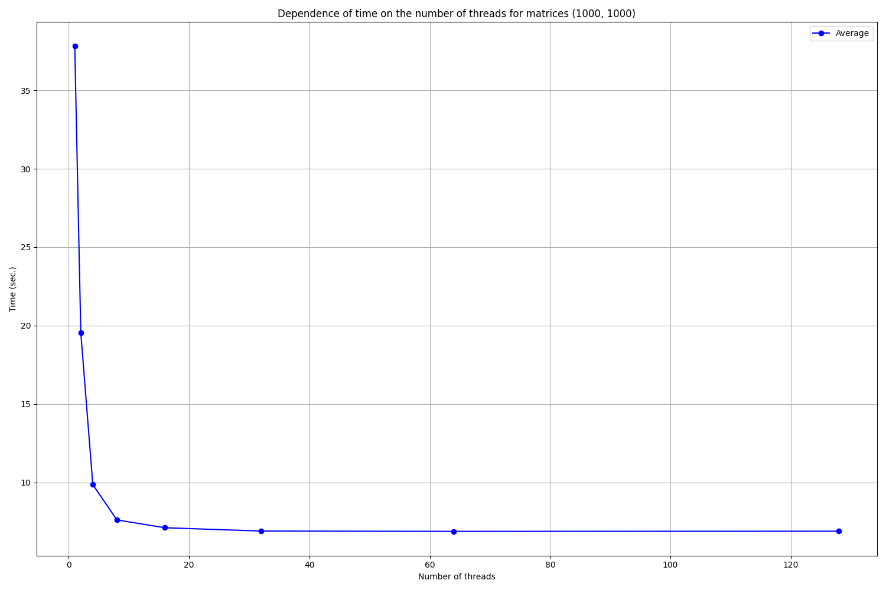
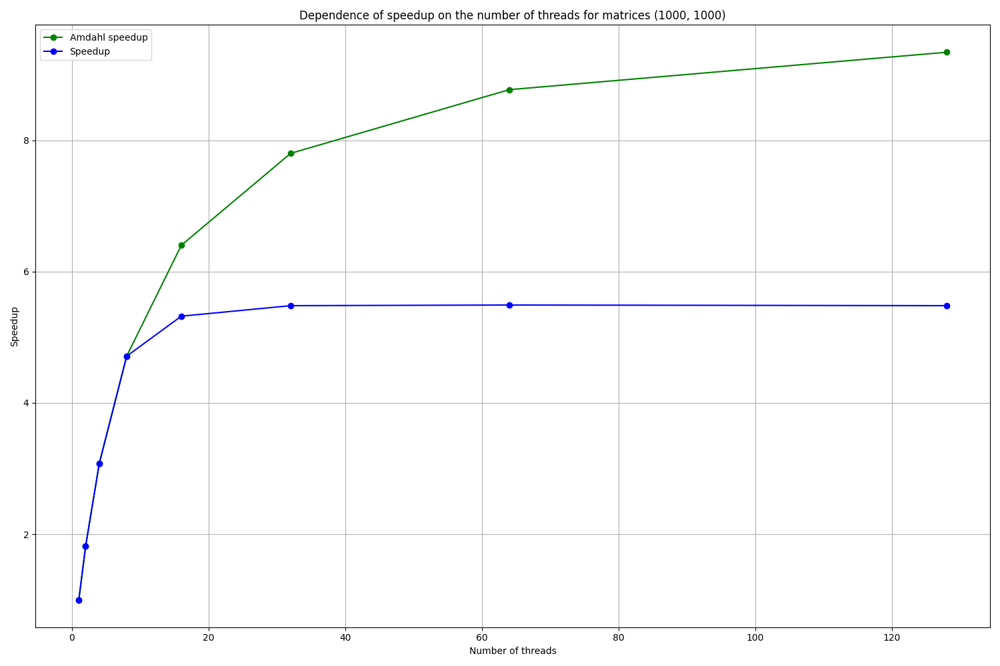
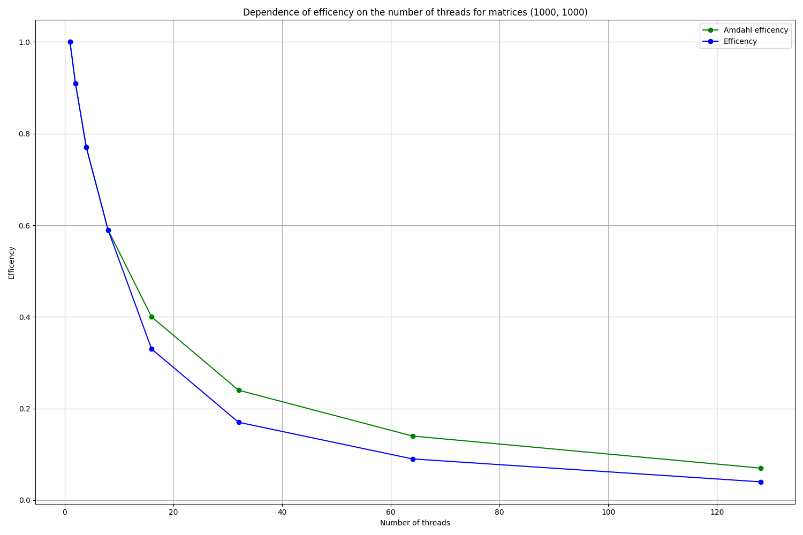
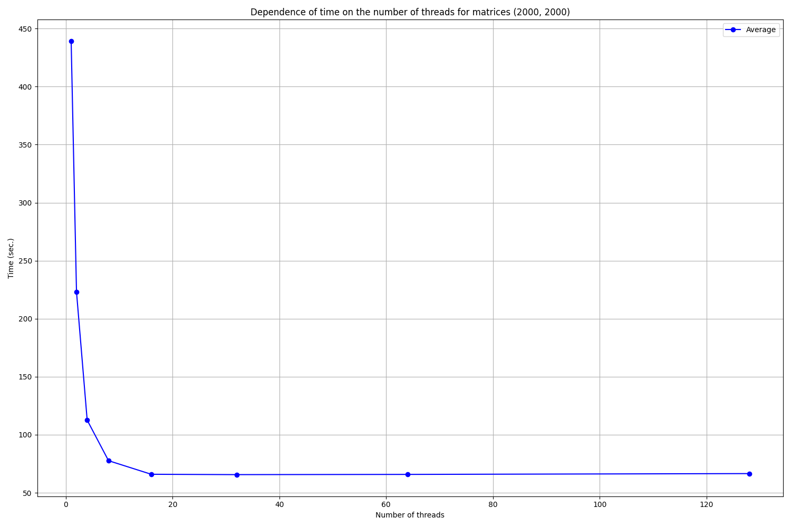
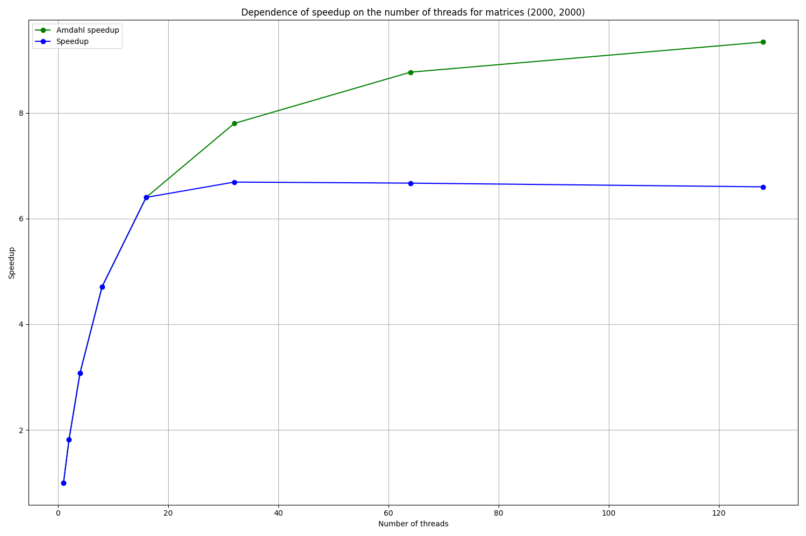
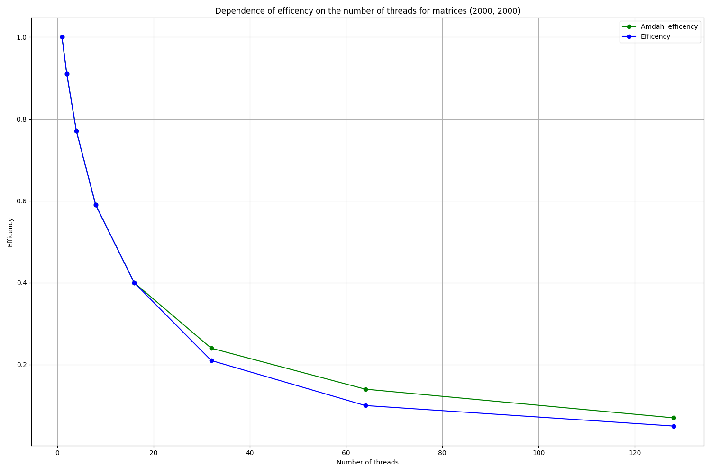
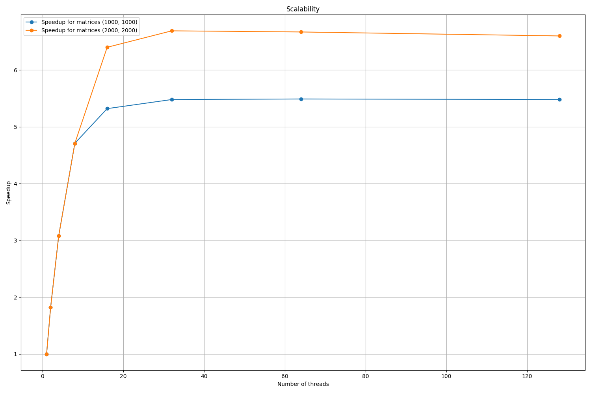

# Лабораторная работа №1

## Задание №A-06

Написать программу вычисления матричного выражения:

$A = Tr(B^3 C) E + I + B \\&\\& M$, где
- $Tr(...)$ - след матрицы, сумма ее диагональных элементов;
- $\\&\\&$ - поэлементное логическое «И».
- $B$, $C$ – квадратные плотные матрицы, элементы которых имеют тип `double`, их элементы задаются с помощью генератора псевдослучайных чисел;
- $E$ – полностью заполненная матрица, все элементы которой равны $1$;
- $I$ – единичная матрица, все диагональные элементы которой равны $1$;
- $M$ – матрица, элементы которой принимают значения $0$ или $1$ и задаются произвольным образом;

Необходимо распараллелить эту программу с помощью OpenMP Task. Исследовать зависимость масштабируемости параллельной версии программы от ее вычислительной трудоемкости (размера матриц). Проверить корректность параллельной версии. Проверить закона Амдала. Построить зависимость ускорения от числа потоков для заданного примера.

## Программно-аппаратная конфигурация

```
System:
  Distro: Ubuntu 22.04.4 LTS (Jammy Jellyfish)
  Kernel: 5.15.0-122-generic x86_64
  Bits: 64
  Compiler: GCC 11.4.0
  Interpreter: Python 3.10.12
```

```
CPU:
  Model: Intel Xeon E-2136
  Architecture: Coffee Lake
  Cores: 6-core
  Bits: 64
  Speed (MHz):
    Min: 800
    Max: 4500
  Cache:
    L1: 384 KiB
    L2: 1.5 MiB
    L3: 12 MiB
  Flags: 
    avx avx2 ht lm nx pae
    sse sse2 sse3 sse4_1
    sse4_2 ssse3 vmx
```

```
RAM:
  Total: 62.67 GiB
```

## Команды

Компиляция и запуск вычисления матричного выражения с указанной размерностью матриц. Результатом являются данные о времени и статистика об ускорении и эффективности вычисления для разного числа потоков в формате CSV.

```
g++ -fopenmp -o matrix_computation matrix_computation.cpp
./matrix_computation [dimension]
```

Запуск эксперимента, выполняющего компиляцию и вычисление матричного выражения, а также построение графиков времени, ускорения, эффективности и мастабируемости по результатам вычисления в формате CSV. 

```
python3 -m venv venv
./venv/bin/activate
pip install -r ./requirements.txt
python3 ./experiment.py
```

## Решение

### matrix_computation.cpp

Перед выполнением матричных вычислений необходимо создать окружение, позволяющее воспроизводить результаты и минимизирующее внешние воздействия на них.

Выполняется установка `seed` `srand(19)` для воспроизводимой псевдослучайной генерации, а также отключаются динамические команды OpenMP `omp_set_dynamic(0)` для принудительной установки числа потоков.

Перед началом матричных вычислений выполняется инициализация констант:
- `n` - размерность квадратной матрицы;
- `pthreads = 8` - максимальная степень числа $2$ (не включительно) для вычисления числа потоков;
- `average = 5` - количество итераций для усреднения результатов.

Также устанавливается число потоков `omp_set_num_threads(nthreads)` для текущей итерации.

Выполняется инициализация числами `double` матриц из условия задачи, которые затем переиспользуются между вычислениями:
- Матрицы $B$ и $C$ заполняются псевдослучайными числами, не умоляя общности, в отрезке $[0.0, 1.0]$;
- Матрица $E$ заполняется числами $1.0$;
- Матрица $I$ заполняется числами $1.0$ на диагонали;
- Матрица $M$ заполняется псевдослучайными числами $0.0$ и $1.0$.

В начале матричного вычисления создаются матрицы для хранения промежуточных результатов вычислений.

Вычисления $Tr(B^3 C) E$ и $B \\&\\& M$ выделяются в параллельные задачи при помощи директивы `#pragma omp task`. Для синхронизации окончания выполнения задач используется директива `#pragma omp taskwait`.

Для распараллеливания большинства циклов используется директива `#pragma omp parallel for collapse(2)`, позволяющая разложить матрицы на независимые компоненты, каждая из которых будет отдана на обработку отдельному потоку.
Клауза `collapse(2)` позволяет линеаризовать вложенные циклы для увеличения числа подзадач. Это позволяет добиться более эффективного использования выделенных потоков.

Умножение матриц происходит методом «строка на столбец», а результат записывается промежуточную матрицу, что позволяет избежать зависимостей по данным.
Таким образом вычисляется $B^3 C$.

Затем вычисляется след матрицы $Tr(B^3 C)$, который распараллелин c помощью директивы `#pragma omp parallel for reduction(+:sum)`. Клауза `reduction(+:sum)` позволяет вычислять частичные суммы в потоках локально, а затем получать конечную сумму в мастер-потоке.

Следующим шагом происходит вычисление $Tr(B^3 C) E$ - умножение матрицы на константу, где распараллелин цикл.

Затем вычисляется поэлементное логическое «И» $B \\&\\& M$, где распараллелин цикл.

После окончания выполнения параллельных задач вычисляется результирующая матрица $A$ через сумму раннее вычисленных матриц $A = Tr(B^3 C) E + I + B \\&\\& M$, где распараллелин цикл.

Время вычисления замеряется с помощью разности значений `omp_get_wtime()`, сохраненных до и после вычисления. Для усреднения сохраняется общее время всех итераций.

По окончании вычисления в однопоточном режиме сохраняется результирующая матрица $A$. Она используется для сравнения с результирующими матрицами $A$, вычисленными в многопоточном режиме. Таким образом проверяется корректность распараллеливания программы для всех вычислений.

В завершении происходит подсчет статистики матричных вычислений. Вычисляются коэффициенты ускорения и эффективности исходя из полученных значений и законов Амдала, которые определяют предельные значения.
Размер параллельной части программы для законов Амдала был оценен как $0.9$.

Перед завершением программы результаты времени матричных вычислений и статистика сохраняются в формате CSV для дальнейшего представления и интерпретации.

### experiment.py

Для представления результатов в виде графиков и их интерпретации используется скрипт, который запускает матричные вычисления и получает результаты и статистику в формате CSV. Для построения графиков используются `pandas` и `matplotlib`.

Сперва происходит запуск быстрого эксперимента с размерностью матриц $500$, чтобы проверить, что все работает. Затем эксперимент выполняется для матриц размерностью $1000$ и $2000$, что занимает ощутимо больше времени.

В ходе каждого эксперимента строится график времени, ускорения и эффективности матричных вычислений в сравнении с предельными значениями из законов Амдала.
На заключительном шаге строится график масштабируемости для матриц разной размерности.

## Результаты

### Размерность матриц $1000$

Таблица $1$ времени матричных вычислений для разного числа потоков. В таблице содержится время каждого из пяти запусков и среднее время для каждого числа потоков.

| Потоки | 1     | 2     | 3     | 4     | 5     | Среднее (сек.) |
|--------|-------|-------|-------|-------|-------|----------------|
| 1      | 38.02 | 37.57 | 37.66 | 37.71 | 38.07 | 37.81          |
| 2      | 19.60 | 19.66 | 19.51 | 19.56 | 19.44 | 19.56          |
| 4      | 9.95  | 9.79  | 9.82  | 9.88  | 9.87  | 9.86           |
| 8      | 7.65  | 7.51  | 7.62  | 7.65  | 7.62  | 7.61           |
| 16     | 7.17  | 7.16  | 7.08  | 7.06  | 7.09  | 7.11           |
| 32     | 6.88  | 6.94  | 6.90  | 6.88  | 6.87  | 6.90           |
| 64     | 6.85  | 6.90  | 6.89  | 6.89  | 6.90  | 6.88           |
| 128    | 6.90  | 6.89  | 6.90  | 6.89  | 6.89  | 6.89           |

По табличным данным был построен график $1$: зависимости времени от числа потоков.



Таблица $2$ коэффициентов ускорения и эффективности для разного числа потоков в сравнении с предельными значениями из законов Амдала.

| Потоки | Ускорение Амдала | Ускорение | Эффективность Амдала | Эффективность |
|--------|------------------|-----------|----------------------|---------------|
| 1      | 1.00             | 1.00      | 1.00                 | 1.00          |
| 2      | 1.82             | 1.82      | 0.91                 | 0.91          |
| 4      | 3.08             | 3.08      | 0.77                 | 0.77          |
| 8      | 4.71             | 4.71      | 0.59                 | 0.59          |
| 16     | 6.40             | 5.32      | 0.40                 | 0.33          |
| 32     | 7.80             | 5.48      | 0.24                 | 0.17          |
| 64     | 8.77             | 5.49      | 0.14                 | 0.09          |
| 128    | 9.34             | 5.48      | 0.07                 | 0.04          |

По табличным данным был построен график $2$: зависимости ускорения от числа потоков.



По табличным данным был построен график $3$: зависимости эффективности от числа потоков.



### Размерность матриц $2000$

Таблица $3$ времени матричных вычислений для разного числа потоков. В таблице содержится время каждого из пяти запусков и среднее время для каждого числа потоков.

| Потоки | 1      | 2      | 3      | 4      | 5      | Среднее (сек.) |
|--------|--------|--------|--------|--------|--------|----------------|
| 1      | 439.34 | 438.91 | 438.95 | 438.96 | 438.88 | 439.01         |
| 2      | 223.30 | 223.55 | 222.96 | 222.96 | 222.89 | 223.13         |
| 4      | 112.48 | 112.68 | 112.75 | 112.73 | 112.35 | 112.60         |
| 8      | 77.75  | 77.67  | 78.04  | 77.74  | 77.05  | 77.65          |
| 16     | 65.82  | 65.72  | 65.87  | 65.84  | 66.51  | 65.95          |
| 32     | 65.65  | 65.66  | 65.61  | 65.50  | 65.80  | 65.64          |
| 64     | 65.85  | 65.76  | 65.87  | 65.83  | 65.84  | 65.83          |
| 128    | 66.61  | 66.55  | 66.51  | 66.45  | 66.53  | 66.53          |

По табличным данным был построен график $4$: зависимости времени от числа потоков.



Таблица $4$ коэффициентов ускорения и эффективности для разного числа потоков в сравнении с предельными значениями из законов Амдала.

| Потоки | Ускорение Амдала | Ускорение | Эффективность Амдала | Эффективность |
|--------|------------------|-----------|----------------------|---------------|
| 1      | 1.00             | 1.00      | 1.00                 | 1.00          |
| 2      | 1.82             | 1.82      | 0.91                 | 0.91          |
| 4      | 3.08             | 3.08      | 0.77                 | 0.77          |
| 8      | 4.71             | 4.71      | 0.59                 | 0.59          |
| 16     | 6.40             | 6.40      | 0.40                 | 0.40          |
| 32     | 7.80             | 6.69      | 0.24                 | 0.21          |
| 64     | 8.77             | 6.67      | 0.14                 | 0.10          |
| 128    | 9.34             | 6.60      | 0.07                 | 0.05          |

По табличным данным был построен график $5$: зависимости ускорения от числа потоков.



По табличным данным был построен график $6$: зависимости эффективности от числа потоков.



### Масштабируемость

Для оценки масштабируемости в зависимости от размерности матриц был построен график $7$. На нем сравниваются графики ускорения для приведенных размерностей матриц.



## Выводы

Построенные графики зависимости ускорения и эффективности от числа потоков демонстрируют схожую тенденцию с законом Амдала. При небольшом числе потоков оба графика практически полностью совпадают, однако с увеличением числа потоков они начинают расходиться - снижается и ускорение, и эффективность. Это подтверждает, что при большом числе потоков значительную роль играют накладные расходы на создание, синхронизацию и остановку потоков, а количество выполненной полезной работы для каждого потока снижается.

По построенному графику масштабируемости для размерностей матриц $1000$ и $2000$ ясно, что чем выше трудоемкость задачи, тем больше масштабируются её вычисления, а значит может быть достигнуто большее ускорение и эффективность вычислений.
